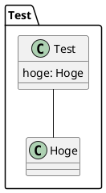
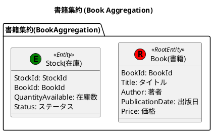
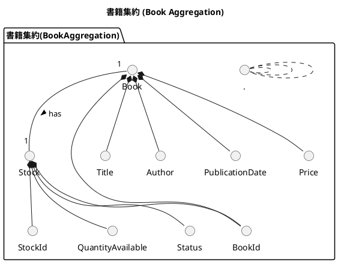

# はじめに

本章ではイベントストーミングを通じて識別された集約を、PlantUML を使って図式化し、更に詳細なドメインモデルを作成していきます。PlantUML の詳しい仕様についてはここでは説明しません。公式をご参照ください。
https://plantuml.com/ja/

# PlantUML とは

PlantUML は、テキストベースで UML（Unified Modeling Language）図を作成するためのオープンソースツールです。このツールは、シンプルな疑似コードとプレーンテキスト記述を使用して、シーケンス図、クラス図、アクティビティ図、コンポーネント図、ステート図など、さまざまな種類の UML 図を生成することができます。

## PlantUML の主な特徴

- 視覚的な図を**コードで表現**するため、バージョン管理システムを用いて簡単に変更履歴を追跡したり、チームでのコラボレーションを行うことが可能です。
- シーケンス図、ユースケース図、クラス図など、UML のさまざまな図をサポートしているため、あらゆる種類のモデリングに対応できます。
- 理解しやすく簡潔な構文を使用しており、大規模な図でも管理しやすくなっています。
  多様な図のサポート: シーケンス図、ユースケース図、クラス図など、UML のさまざまな図をサポートしているため、あらゆる種類のモデリングに対応できます。
- さまざまなエディタや IDE（統合開発環境）と統合することができ、プラグインやエクステンションを使用して機能を拡張できます。

# 環境のセットアップ

PlantUML を使用するための環境設定について説明します。ここでは、Visual Studio Code（VS Code）をエディタとして使用します。

## PlantUML のインストール

VS Code を開き、PlantUML 拡張機能を見つけてインストールしてください。


## 動作確認

適当な場所で「test.pu」ファイルを作成し、以下の内容をコピペしてください。

```bash
$ touch test.pu
```



次に「test.pu」ファイルを VS Code で開いている状態で「option + D」を押下し以下のように表示されれば動作確認完了になります。test.pu ファイルは以降使用しないので削除しましょう。


# ドメインモデル図の作成

ドメインモデル図を簡単に説明すると、ドメイン知識を反映したクラス図です。イベントストーミングの成果を参照し、在庫管理ドメインの集約とその属性、ルール、関連性、多重度を PlantUML を利用し表現していきましょう。
@[figma](https://www.figma.com/file/g04nAogGCGgM62IKXHUSLT/Online-bookstore?type=whiteboard&node-id=843-1791&t=0509ZPxx9p8xu8qE-0)

## プロジェクトディレクトリの作成

ターミナルを開き、プロジェクトディレクトリを作成する場所に移動し、新しいディレクトリを作成します。ディレクトリ名はドメイン名とします。

```bash
$ mkdir OnlineBookstore
```

さらにサブディレクトリを作成します。ディレクトリ名はコアドメインもしくはサブドメイン名になります。ここでは StockManagementDomain(在庫管理)とします。

```bash
$ mkdir OnlineBookstore/StockManagementDomain
```

さらにサブディレクトリを作成します。ディレクトリ名は共通で「Domain」になります。

```bash
$ mkdir OnlineBookstore/StockManagementDomain/Domain
```

:::message
この Domain ディレクトリは DDD にとって最も重要で、ドメインモデル図やドメインオブジェクトのコードなどドメインに関連する情報が集約されます。
:::

さらにサブディレクトリを作成します。ディレクトリ名は共通で「models」になります。ここではドメインモデルを配置することになります。

```bash
$ mkdir OnlineBookstore/StockManagementDomain/Domain/models
```

さらにサブディレクトリを作成します。ディレクトリ名は集約名になります。ここではイベントストーミングを参照し在庫管理コンテキストの集約の一つである「書籍(Book)」を作成します。

```bash
$ mkdir OnlineBookstore/StockManagementDomain/Domain/models/Book
```

## ドメインモデルの作成

ドメインモデルを設計します。以下のコマンドで Book.pu ファイルを作成します。拡張子は **.pu** となります。

```bash
$ cd OnlineBookstore/StockManagementDomain/Domain/models/Book
$ touch Book.pu
```

次に、PlantUML のコードを解説します。

1. **エンティティの定義**
   エンティティをクラス図で表現し、持つべき属性の対訳(英語 ⇆ 日本語)を定義します。
   **Book (Root Entity):** 「**集約のルート**」として機能するエンティティです。BookId、タイトル、著者、出版日、価格、そしてステータスという属性を持ちます。
   **Stock:** 在庫を表すエンティティで、StockId、BookId、在庫数、ステータスという属性を持ちます。
   :::message
   集約のルートとはデータの入出力の単位であり、強整合性が担保できる範囲です。(TODO:うめる)編で詳しく説明します。
   :::



2. **属性（値オブジェクト）の定義**
   エンティティの属性を型でより詳細に表現します。

```plantuml:OnlineBookstore/.../Book/Book.pu
@startuml BookAggregation

title 書籍集約 (Book Aggregation)

package "書籍集約(BookAggregation)" {
    ' 1. エンティティの定義
    ...
    ' 2. 属性(値オブジェクト)の定義
    class "BookId" as BookId {
        + value: string
    }

    class "Title(タイトル)" as Title {
        + value: string
    }

    class "Author(著者)" as Author {
        + value: string
    }

    class "PublicationDate(出版日)" as PublicationDate {
        + value: Date
    }

    class "Price(価格)" as Price {
        + value: number
    }

    class "Status(ステータス)" as Status {
       + value: Enum { 販売前, 販売中, 販売停止 }
    }

    class "StockId" as StockId {
        + value: string
    }

    class "QuantityAvailable(在庫数)" as QuantityAvailable {
        + value: number
    }
}

@enduml
```

3. **ルールの追加**
   **note** キーワードを使用して、特定の属性や関連に対するビジネスルールや制約を追加しています。これらのルールは、ドメインの整合性を保つために必要です。

```plantuml:OnlineBookstore/.../Book/Book.pu
@startuml BookAggregation

title 書籍集約 (Book Aggregation)

package "書籍集約(BookAggregation)" {
    ' 1. エンティティの定義
    ...
    ' 2. 属性(値オブジェクト)の定義
    ...
    ' 3. ルールの追加
    note bottom of BookId
        ISBNを適用する。
        ISBNとは登録出版者の責任において、
        書籍の書名(タイトル)ごとに付与される番号。
    end note

    note bottom of Title
        MAX_LENGTH = 1000
        MIN_LENGTH = 1
    end note

    note bottom of Author
        MAX_LENGTH = 1000
        MIN_LENGTH = 1
    end note

    note bottom of QuantityAvailable
        整数のみ許可
    end note

    note bottom of Price
        日本円のみ扱う。
        MAX = 1,000,000
        MIN = 1
    end note

    note bottom of Stock
	 - 初回作成時、ステータスは「販売前」から始まる。
	 - 在庫数は0の場合は在庫切れ。
    end note

    note bottom of Status
        書籍のステータスは、 PreSale (販売前), OnSale (販売中),
        Discontinued (販売停止)の3つ
    end note
}

@enduml
```

4. **関連性の定義**
   関連性はエンティティと値オブジェクトの間のリンクを示しています。このモデルでは、Book エンティティと Stock エンティティが 1 対 1 の関係にあり、Book、Stock は複数の値オブジェクトと関連付けられています。



それでは、「option + D」でドメインモデル図を確認してみましょう。

この図は、書籍集約のドメインモデルを視覚的に表現しており、各エンティティや値オブジェクト、それらの関係性、そしてビジネスルールを明確に理解するのに役立ちます。これにより、機能の実装やドメインロジックの検証に効率的に取り組むことが可能になります。

# ここまでのディレクトリ階層構造

```js:
OnlineBookstore/
└───StockManagementDomain/
    └───Domain/
        └───models/
            ├───Book/
		└───Book.pu
```
