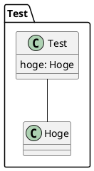
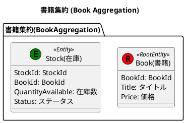
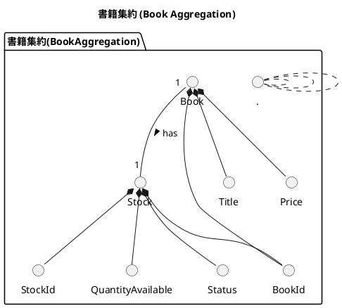
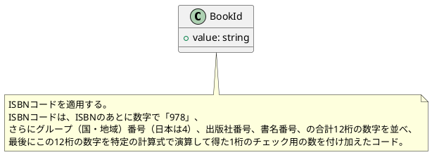
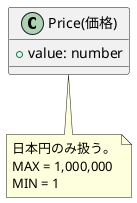
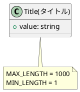
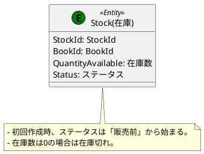
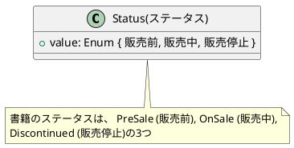

# はじめに

本章ではイベントストーミングを通じて識別された集約を、PlantUML を使って図式化し、更に詳細なドメインモデルを作成していきます。PlantUML の詳しい仕様についてはここでは説明しません。公式をご参照ください。
https://plantuml.com/ja/

# PlantUML とは

PlantUML は、テキストベースで UML（Unified Modeling Language）図を作成するためのオープンソースツールです。このツールは、シンプルな疑似コードとプレーンテキスト記述を使用して、シーケンス図、クラス図、アクティビティ図、コンポーネント図、ステート図など、さまざまな種類の UML 図を生成することができます。

## PlantUML の主な特徴

- 視覚的な図を**コードで表現**するため、バージョン管理システムを用いて簡単に変更履歴を追跡したり、チームでのコラボレーションを行うことが可能です。
- シーケンス図、ユースケース図、クラス図など、UML のさまざまな図をサポートしているため、あらゆる種類のモデリングに対応できます。
- 理解しやすく簡潔な構文を使用しており、大規模な図でも管理しやすくなっています。
  多様な図のサポート: シーケンス図、ユースケース図、クラス図など、UML のさまざまな図をサポートしているため、あらゆる種類のモデリングに対応できます。
- さまざまなエディタや IDE（統合開発環境）と統合することができ、プラグインやエクステンションを使用して機能を拡張できます。

# 環境のセットアップ

PlantUML を使用するための環境設定について説明します。ここでは、Visual Studio Code（VS Code）をエディタとして使用します。

## PlantUML のインストール

VS Code を開き、PlantUML 拡張機能を見つけてインストールしてください。


## 動作確認

適当なディレクトリで「test.pu」ファイルを作成し、コードをコピペしてください。

```bash
$ touch test.pu
```



次に VS Code で「test.pu」ファイルを開いている状態で「option + D」を押下し以下のように表示されれば動作確認完了になります。「test.pu」 ファイルは以降使用しないので削除しましょう。


# ドメインモデル図の作成

ドメインモデル図を簡単に説明すると、ドメイン知識を反映したクラス図です。以下のイベントストーミングの成果を参照し、在庫管理ドメインの集約とその属性、ルール、関連性、多重度を PlantUML を利用し表現していきましょう。
@[figma](https://www.figma.com/file/g04nAogGCGgM62IKXHUSLT/Online-bookstore?type=whiteboard&node-id=843-1791&t=0509ZPxx9p8xu8qE-0)

## プロジェクトディレクトリの作成

ターミナルを開き、プロジェクトディレクトリを作成する場所に移動し、新しいディレクトリを作成します。ディレクトリ名はドメイン名とします。

```bash
$ mkdir OnlineBookstore
```

さらにサブディレクトリを作成します。ディレクトリ名はコアドメインもしくはサブドメイン名になります。ここでは StockManagementDomain(在庫管理)とします。

```bash
$ mkdir StockManagement
```

さらにサブディレクトリを作成します。ディレクトリ名は共通で「Domain」になります。

```bash
$ mkdir StockManagement/Domain
```

:::message
この Domain ディレクトリは DDD にとって最も重要で、ドメインモデル図やドメインオブジェクトのコードなどドメインに関連する情報が集約されます。
:::

さらにサブディレクトリを作成します。ディレクトリ名は共通で「models」になります。ここではドメインモデルを配置することになります。

```bash
$ mkdir StockManagement/Domain/models
```

さらにサブディレクトリを作成します。ディレクトリ名は集約名になります。ここではイベントストーミングの図を参照し、在庫管理コンテキストの集約の一つである「書籍(Book)」を作成します。

```bash
$ mkdir StockManagement/Domain/models/Book
```

## ドメインモデルの作成

ドメインモデルを設計します。以下のコマンドで 「Book.pu」 ファイルを作成します。拡張子は 「**.pu**」 となります。

```bash
$ cd StockManagement/Domain/models/Book
$ touch Book.pu
```

次に、PlantUML のコードを解説します。

1. **エンティティの定義**
   エンティティをクラス図で表現し、持つべき属性の対訳(英語 ⇆ 日本語)を定義します。
   **Book (Root Entity):** 「**集約のルート**」として機能するエンティティです。
   **Stock:** 在庫を表すエンティティです。
   :::message
   集約のルートとはデータの入出力の単位であり、強整合性が担保できる範囲を指します。(TODO:うめる)編で詳しく説明します。
   :::



1. **属性の定義**
   エンティティの属性をクラス図で表現し、型を定義します。

```plantuml:StockManagement/Domain/models/Book/Book.pu
@startuml BookAggregation

title 書籍集約 (Book Aggregation)

package "書籍集約(BookAggregation)" {
    ' 1. エンティティの定義
    ...
    ' 2. 属性の定義
    class "BookId" as BookId {
        + value: string
    }

    class "Title(タイトル)" as Title {
        + value: string
    }

    class "Price(価格)" as Price {
        + value: number
    }

    class "Status(ステータス)" as Status {
       + value: Enum { 販売前, 販売中, 販売停止 }
    }

    class "StockId" as StockId {
        + value: string
    }

    class "QuantityAvailable(在庫数)" as QuantityAvailable {
        + value: number
    }
}

@enduml
```

3. **ルールの追加**
   **note** キーワードを使用して、特定のエンティティや属性、その関連に対するビジネスルールや制約を追加しています。これらのルールは、ドメインの整合性を保つために必要です。

```plantuml:StockManagement/Domain/models/Book/Book.pu
@startuml BookAggregation

title 書籍集約 (Book Aggregation)

package "書籍集約(BookAggregation)" {
    ' 1. エンティティの定義
    ...
    ' 2. 属性の定義
    ...
    ' 3. ルールの追加
    note bottom of BookId
        ISBNコードを適用する。
        ISBNコードは、ISBNのあとに数字で「978」、
        さらにグループ（国・地域）番号（日本は4）、出版社番号、書名番号、の合計12桁の数字を並べ、
        最後にこの12桁の数字を特定の計算式で演算して得た1桁のチェック用の数を付け加えたコード。
    end note

    note bottom of Title
        MAX_LENGTH = 1000
        MIN_LENGTH = 1
    end note

    note bottom of QuantityAvailable
        MAX = 1,000,000
        MIN = 1
    end note

    note bottom of Price
        日本円のみ扱う。
        MAX = 1,000,000
        MIN = 1
    end note

    note bottom of Stock
	 - 初回作成時、ステータスは「販売前」から始まる。
	 - 在庫数は0の場合は在庫切れ。
    end note

    note bottom of Status
        書籍のステータスは、 PreSale (販売前), OnSale (販売中),
        Discontinued (販売停止)の3つ
    end note
}

@enduml
```

4. **関連性の定義**
   関連性はエンティティと属性の間のリンクを示しています。このモデルでは、Book エンティティと Stock エンティティが 1 対 1 の関係にあり、Book、Stock はそれぞれ複数の属性と関連付していることがわかります。



それでは、「option + D」で完成したドメインモデル図を確認してみましょう。

この図は、書籍集約のドメインモデルを視覚的に表現しており、各エンティティや属性、それらの関係性、そしてビジネスルールを明確に理解するのに役立ちます。この図により、機能の実装やドメインロジックのテストに効率的に取り組むことが可能になります。

## ディレクトリの分割

次のステップでは、エンティティ、属性の粒度で個別のファイルやディレクトリに割り当てます。このフェーズでは、エンティティや属性(値オブジェクト)の実装に向け管理しやすい構造の作成を目指します。
PlantUML では「!include ./BookId/BookId.pu」のように相対パスで UML ファイルを読み込むことができます。それではこの機能を利用し、分割していきましょう。

```plantuml:StockManagement/Domain/models/Book/Book.pu
@startuml Book

!include ./BookId/BookId.pu
!include ./Title/Title.pu
!include ./Price/Price.pu

class "Book(書籍)" as Book << (R,red) RootEntity >> {
    BookId: BookId
    Title: タイトル
    Price: 価格
}

Book *-down- BookId
Book *-down- Title
Book *-down- Price

@enduml
```

:::details .../Book/BookId/BookId.pu



:::

:::details .../Book/Book/Price/Price.pu



:::

:::details .../Book/Book/Title/Title.pu



:::

:::details .../Book/Book/QuantityAvailable/QuantityAvailable.pu

```plantuml:StockManagement/Domain/models/Book/QuantityAvailable/QuantityAvailable.pu

@startuml QuantityAvailable

class "QuantityAvailable(在庫数)" as QuantityAvailable {
    + value: number
}

note bottom of QuantityAvailable
    MAX = 1,000,000
    MIN = 1
end note

@enduml
```

:::



:::details .../Book/Stock/StockId/StockId.pu

```plantuml:StockManagement/Domain/models/Book/Stock/StockId/StockId.pu

@startuml StockId

class "StockId" as StockId {
    + value: string
}

@enduml
```



:::

:::details .../Book/Stock/Status/Status.pu



:::

```plantuml:StockManagement/Domain/models/Book/BookAggregation.pu

@startuml BookAggregation

title 書籍集約 (Book Aggregation)

package "書籍集約(BookAggregation)" {
    !include ./Book.pu
    !include ./Stock/Stock.pu

    Book "1" -down- "1" Stock : has >
}

@enduml

```

「BookAggregation.pu」ファイルで「option + D」を押下し、分割前のドメインモデル図と同じ図が表示されれば完了です。

# まとめ

- PlantUML は、テキストベースで UML（Unified Modeling Language）図を作成するためのオープンソースツールで、ドメインモデル図を簡単に作成できる。
- ドメインモデル図は、ドメイン知識を反映したクラス図で、機能の実装やドメインロジックのテストの仕様書として活用できる。

本章では、PlantUML を使用してドメインモデル図を作成するプロセスを解説しました。
お待たせしました。第 2 部からはドメイン駆動設計の戦術的設計に焦点を当て、ドメインモデリングの成果物をもとに具体的なコードの実装を行っていきます。

### これまでのコード

https://github.com/yamachan0625/ddd-hands-on/tree/domain-modeling
