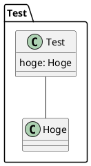
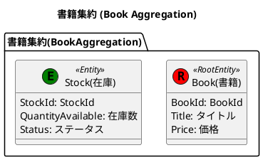
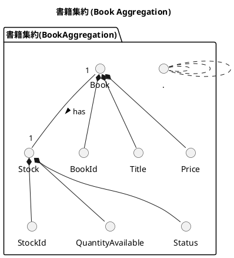
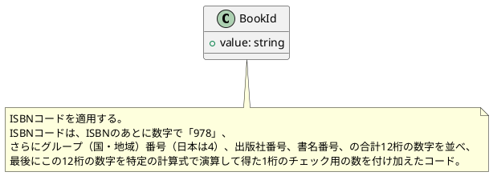
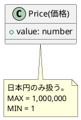
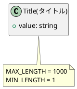
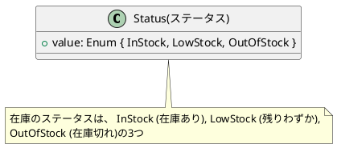

# ドメインモデル図とは

ドメインモデル図とは、特定のドメインの主要な概念、エンティティ、その属性、およびこれらの要素間の関係性を視覚的に表現した図です。この図は、ビジネスルールやロジックを反映し、開発チームとビジネスステークホルダー間の共通理解とコミュニケーションをより促進するために用いられます。

本章ではイベントストーミングを通じて識別された集約を、PlantUML `を使って図式化し、ドメインモデル図を作成していきます。PlantUML` の詳しい仕様については[公式ドキュメント](https://plantuml.com/ja/)をご参照ください。

# PlantUML の主な特徴

- 視覚的な図を**コードで表現**するため、バージョン管理システムを用いて簡単に変更履歴を追跡したり、チームでのコラボレーションを行うことが可能
- 理解しやすく簡潔な構文を使用しており、大規模な図でも管理が容易
- シーケンス図、ユースケース図、クラス図など、`UML` の多様な図をサポートしているため、あらゆる種類のモデリングに対応できます。
- さまざまなエディターや`IDE`と統合することができ、プラグインやエクステンションを使用して機能を拡張できます。

# 環境のセットアップ

PlantUML を使用するための環境設定について説明します。ここでは、`Visual Studio Code (VS Code)` をエディターとして使用します。

## PlantUML のインストール

`VS Code` を開き、`PlantUML` 拡張機能を見つけてインストールしてください。


## 動作確認

適当なディレクトリで`test.pu`ファイルを作成し、以下のコードをコピペしてください。



次に `VS Code` で`test.pu`ファイルを開いている状態で`option + D`を押下し以下のように表示されれば動作確認完了になります。`test.pu`ファイルは以降使用しないので削除しましょう。


# ドメインモデル図の作成

以下のイベントストーミングの成果を参照し、在庫管理ドメインの集約とその属性、ルール、関連性、多重度を `PlantUML` を利用し表現していきましょう。
@[figma](https://www.figma.com/file/g04nAogGCGgM62IKXHUSLT/Online-bookstore?type=whiteboard&node-id=843-1791&t=0509ZPxx9p8xu8qE-0)

## プロジェクトディレクトリの作成

ターミナルを開き、プロジェクトディレクトリを作成する場所に移動し、新しいディレクトリを作成します。ディレクトリ名はドメイン名とします。

```bash
$ mkdir OnlineBookstore
```

さらにサブディレクトリを作成します。ディレクトリ名はコアドメインもしくはサブドメイン名になります。ここでは `StockManagementDomain` (在庫管理) とします。

```bash
$ mkdir StockManagement
```

さらにサブディレクトリを作成します。ディレクトリ名はすべてのドメイン共通で`Domain`とします。

```bash
$ mkdir StockManagement/Domain
```

:::message
この `Domain` ディレクトリはドメイン駆動設計にとって非常に重要で、ドメインモデル図やドメインオブジェクトのコードなどドメインに関連する情報が集約されます。
:::

さらにサブディレクトリを作成します。ディレクトリ名は`models`になります。ここにはドメインモデルを配置することになります。

```bash
$ mkdir StockManagement/Domain/models
```

さらにサブディレクトリを作成します。ディレクトリ名は集約名になります。ここではイベントストーミングの図を参照し、在庫管理コンテキストの集約の一つである書籍 (Book)を作成します。

```bash
$ mkdir StockManagement/Domain/models/Book
```

## ドメインモデル図の作成

ドメインモデル図は以下のステップで作成していきます。

1. 集約の定義
2. 属性の定義
3. ビジネスルールの追加
4. 関連性の定義

`StockManagement/Domain/models/Book`配下に`Book.pu`ファイルを作成します。拡張子は`.pu`となります。

それでは各ステップごとに確認していきましょう。

1. **集約の定義**
   集約をクラス図で表現し、保持する属性の対訳 (英語 ⇆ 日本語) を定義します。
   **Book (Root Entity) :** **集約のルート**として機能するエンティティです。
   **Stock:** 在庫を表すエンティティです。
   :::message
   集約のルートの詳細は`chapter10 集約`で説明します。
   :::



2. **属性の定義**
   エンティティが持つ属性をクラス図で表現し、型を定義します。属性とは、エンティティが持つデータや情報のことです。たとえば、書籍の場合はタイトルや価格、在庫の場合は在庫数やステータスなどが属性になります。属性はそのコンテキストによって異なるため、それぞれのコンテキストに合わせて定義します。

```plantuml:StockManagement/Domain/models/Book/Book.pu
@startuml BookAggregation

title 書籍集約 (Book Aggregation)

package "書籍集約(BookAggregation)" {
    ' 1. エンティティの定義
    ...
    ' 2. 属性の定義
    class "BookId" as BookId {
        + value: string
    }

    class "Title(タイトル)" as Title {
        + value: string
    }

    class "Price(価格)" as Price {
        + value: number
    }

    class "Status(ステータス)" as Status {
        + value: Enum { InStock, LowStock, OutOfStock }
    }

    class "StockId" as StockId {
        + value: string
    }

    class "QuantityAvailable(在庫数)" as QuantityAvailable {
        + value: number
    }
}

@enduml
```

3. **ビジネスルールの追加**
   `note`キーワードを使用して、エンティティや属性、その関連に対するビジネスルールや制約を紐付けて追加しています。これらのルールは、ドメインの整合性を保つために必要です。たとえば、書籍のタイトルは 1 文字以上 1000 文字以下である必要があります。このようなルールは、エンティティや属性の定義の際に追加し、ドメインモデル図に反映させます。

```plantuml:StockManagement/Domain/models/Book/Book.pu
@startuml BookAggregation

title 書籍集約 (Book Aggregation)

package "書籍集約(BookAggregation)" {
    ' 1. エンティティの定義
    ...
    ' 2. 属性の定義
    ...
    ' 3. ルールの追加
    note bottom of BookId
        ISBNコードを適用する。
        ISBNコードは、ISBNのあとに数字で「978」、
        さらにグループ（国・地域）番号（日本は4）、出版社番号、書名番号、の合計12桁の数字を並べ、
        最後にこの12桁の数字を特定の計算式で演算して得た1桁のチェック用の数を付け加えたコード。
    end note

    note bottom of Title
        MAX_LENGTH = 1000
        MIN_LENGTH = 1
    end note

    note bottom of QuantityAvailable
        MAX = 1,000,000
        MIN = 1
    end note

    note bottom of Price
        日本円のみ扱う。
        MAX = 1,000,000
        MIN = 1
    end note

    note bottom of Stock
        - 初回作成時、ステータスは「在庫切れ」から始まる。
        - 在庫数は0の場合は在庫切れ。10以下の場合は残りわずか。それ以外は在庫あり。
    end note

    note bottom of Status
        在庫のステータスは、 InStock (在庫あり), LowStock (残りわずか),
        OutOfStock (在庫切れ)の3つ
    end note
}

@enduml
```

1. **関連性の定義**
   関連性はエンティティと属性の間のリンクを示しています。このモデルでは、`Book エンティティ`と `Stock エンティティ`が 1 対 1 の関係にあり、それぞれ複数の属性と関連付けられています。



それでは`option + D`で完成したドメインモデル図を確認してみましょう。

この図は、書籍集約のドメインモデルを視覚的に表現しており、各エンティティや属性、それらの関係性、そしてビジネスルールを明確に理解するのに役立ちます。この図により、機能の実装やドメインロジックのテストに効率的に取り組むことが可能になります。

## ディレクトリの分割

次のステップでは、エンティティ、属性の粒度で個別のファイルやディレクトリに割り当てます。このフェーズでは、エンティティや属性 (値オブジェクト) の実装に向け管理しやすい構造の作成を目指します。
`PlantUML` では`!include ./BookId/BookId.pu`のように相対パスで `UML` ファイルを読み込むことができます。それではこの機能を利用し、分割していきましょう。

```plantuml:StockManagement/Domain/models/Book/Book.pu
@startuml Book

!include ./BookId/BookId.pu
!include ./Title/Title.pu
!include ./Price/Price.pu

class "Book(書籍)" as Book << (R,red) RootEntity >> {
    BookId: BookId
    Title: タイトル
    Price: 価格
}

Book *-down- BookId
Book *-down- Title
Book *-down- Price

@enduml
```

:::details .../Book/BookId/BookId.pu



:::

:::details .../Book/Book/Price/Price.pu



:::

:::details .../Book/Book/Title/Title.pu



:::

:::details .../Book/Book/QuantityAvailable/QuantityAvailable.pu

```plantuml:StockManagement/Domain/models/Book/QuantityAvailable/QuantityAvailable.pu

@startuml QuantityAvailable

class "QuantityAvailable(在庫数)" as QuantityAvailable {
    + value: number
}

note bottom of QuantityAvailable
    MAX = 1,000,000
    MIN = 1
end note

@enduml
```

:::

```plantuml:StockManagement/Domain/models/Book/Stock/Stock.pu

@startuml Stock

!include ./Status/Status.pu
!include ./QuantityAvailable/QuantityAvailable.pu
!include ./StockId/StockId.pu

class "Stock(在庫)" as Stock << (E,green) Entity >> {
    StockId: StockId
    QuantityAvailable: 在庫数
    Status: ステータス
}

Stock *-down- StockId
Stock *-down- QuantityAvailable
Stock *-down- Status

note bottom of Stock
    - 初回作成時、ステータスは「在庫切れ」から始まる。
    - 在庫数は0の場合は在庫切れ。10以下の場合は残りわずか。それ以外は在庫あり。
end note

@enduml

```

:::details .../Book/Stock/StockId/StockId.pu

```plantuml:StockManagement/Domain/models/Book/Stock/StockId/StockId.pu

@startuml StockId

class "StockId" as StockId {
    + value: string
}

@enduml
```



:::

:::details .../Book/Stock/Status/Status.pu



:::

```plantuml:StockManagement/Domain/models/Book/BookAggregation.pu

@startuml BookAggregation

title 書籍集約 (Book Aggregation)

package "書籍集約(BookAggregation)" {
    !include ./Book.pu
    !include ./Stock/Stock.pu

    Book "1" -down- "1" Stock : has >
}

@enduml
```

再度`BookAggregation.pu`ファイルで`option + D`を押下し、分割前のドメインモデル図と同じ図が表示されれば完了です。

# まとめ

- ドメインモデル図は、ドメイン知識を反映したクラス図で、機能の実装やドメインロジックのテストの仕様書として活用できる。

本章では、`PlantUML `を利用してドメインモデル図を作成するプロセスを解説しました。
本章で第 1 部、戦略的設計の章は終了となります。お疲れ様でした。
第 2 部では戦術的設計に焦点を当て、ドメインモデリングの成果物をもとに具体的なコードの実装を行っていきます。

### これまでのコード

https://github.com/yamachan0625/ddd-hands-on/tree/domain-modeling
